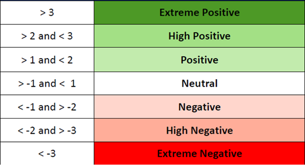
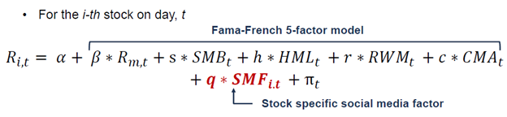

# DailyNewsHeadlines-StocksReturn-Analysis

Link: https://www.kaggle.com/miguelaenlle/massive-stock-news-analysis-db-for-nlpbacktests 

Team members: Mike Wu, Junming Kim, Yifan Gao 

### Motivation 

Try to find the characteristics of securities derived from social media factors have significant power in explaining the time-series variation in daily returns. The Social Media Factor, the “sixth” factor, is distinct from the traditional five factors authored by Fama and French (1992, 1993, and 1994).  

### Methodology 

We are using the complied stock news data scraped directly from its source, using machine learning NLP technic to convert unstructured data to structured data. And we create the sentiment score for each stock and normalize it to be our final sentiment score. 

### Sentiment of the day 

Normalize Sentiment, 20 day look back period 

Validate the sentiment score utilizing the unsupervised clustering method: 

Run a clustering algorithm on stock return and sentiment score.  

Prove the evidence that the characteristics of securities derived from social media information have significant power in explaining the time-series of daily returns using Fama and Frech 5 Factors model: 

### Data 

analyst_ratings_processed.csv: has 1400469 observations and contains title, date and ticker columns. 

us_equities_news_dataset.csv: has 224866 observations and contains ticker, title, category, content, date, provider, url and article_id columns. 

Yahoo Finance feed: we will pull stock prices from Yahoo Finance feed. 

Fama-French Factors - http://mba.tuck.dartmouth.edu/pages/faculty/ken.french/data_library.html 

### Reference 

Fama, Eugene F., and Kenneth R. French, 2015, "A five-factor asset pricing model", Journal of Financial Economics 1-116, 1-22.  

Fama, Eugene F., and Kenneth R. French 2008, “Dissecting Anomalies”, Journal of Finance 63 (4) 1653-1678. 
 
